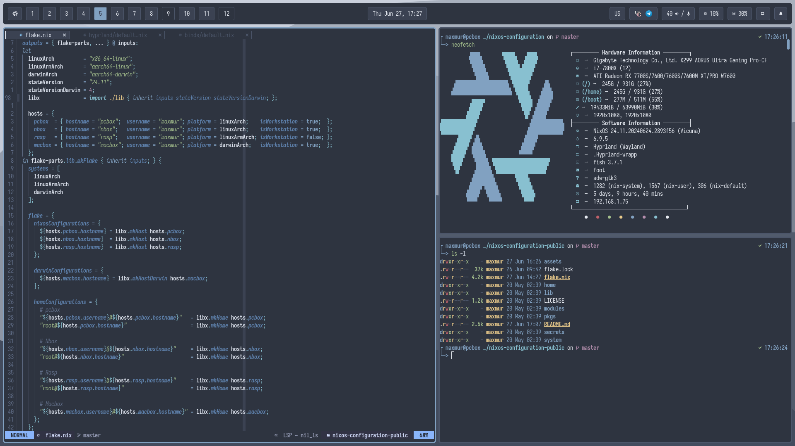
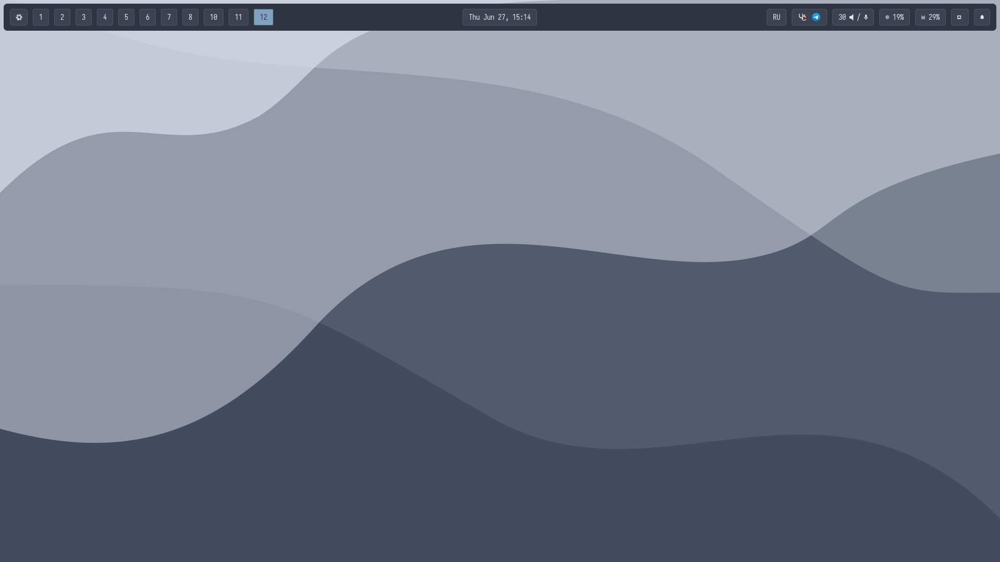
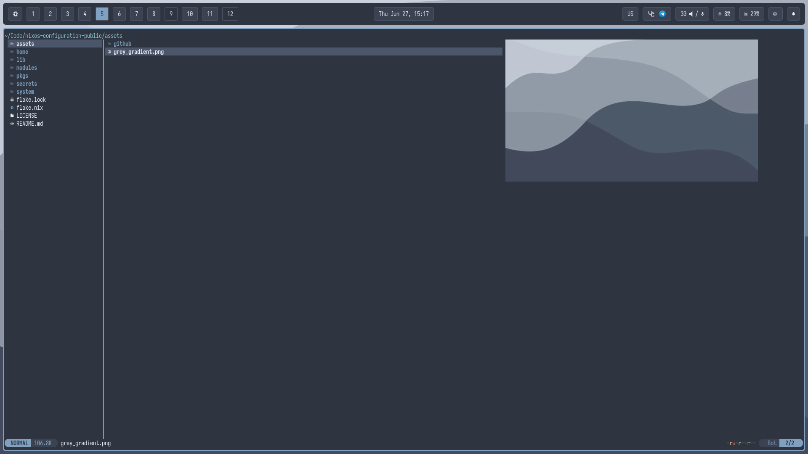
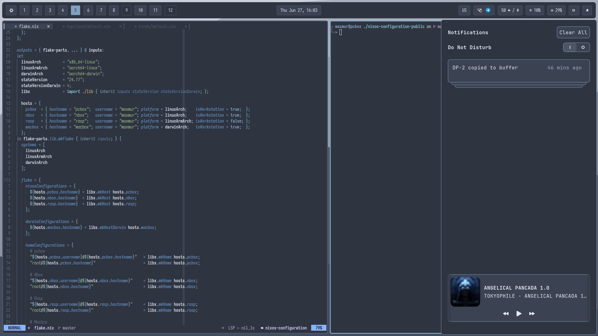
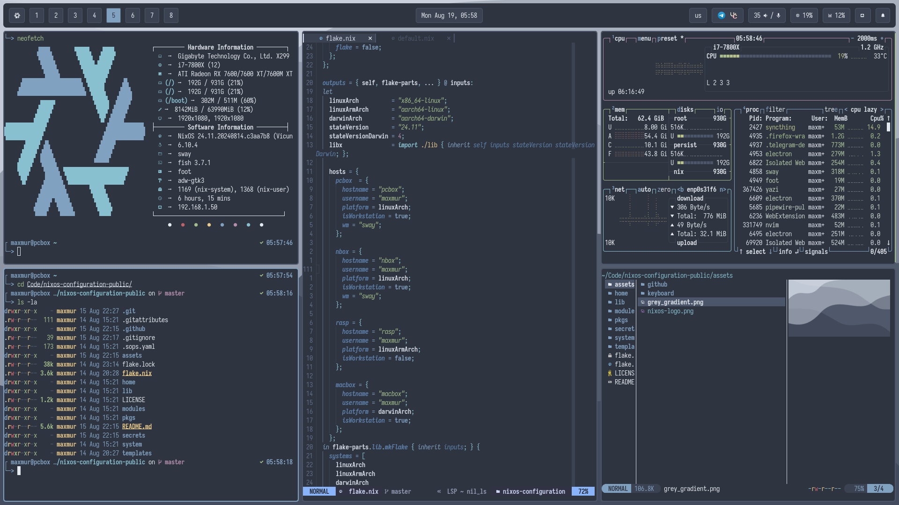
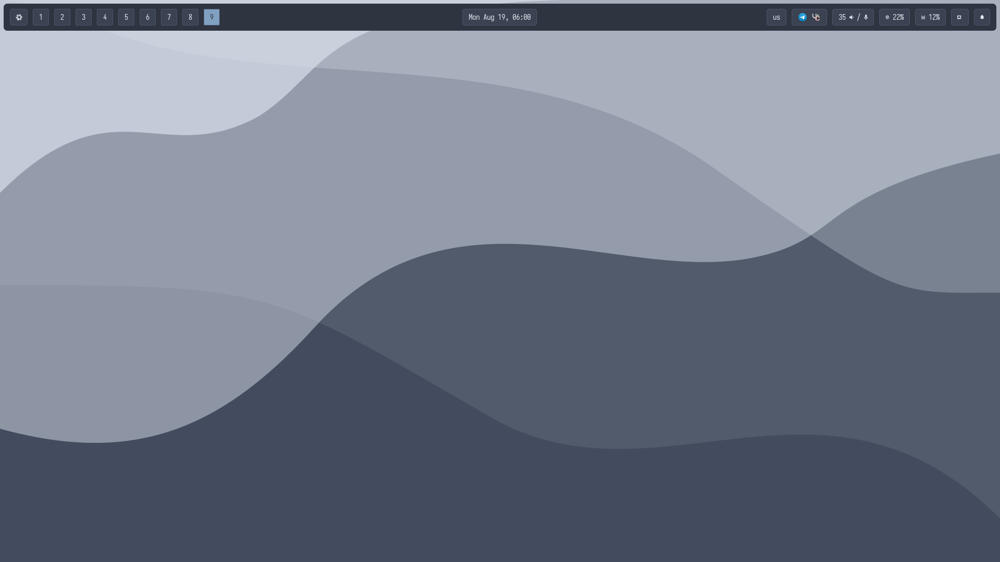
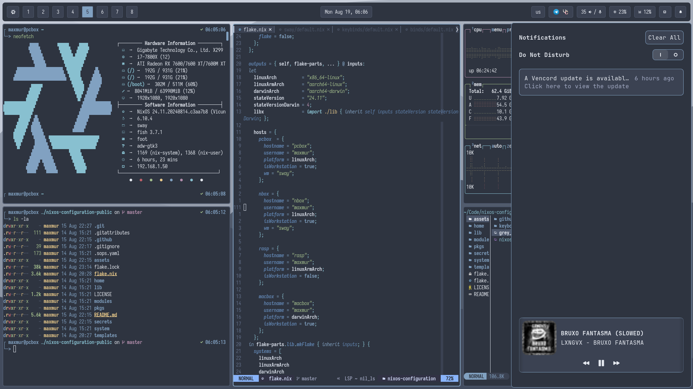

<h1 align="center">Corggie ❄️ NixOS Public Configuration</h1>

## Table of contents

- [Features](#-features)
- [File structure](#-file-structure)
- [Desktop preview](#%EF%B8%8F-desktop-preview)
    - [Hyprland](#-hyprland)
    - [Sway](#-sway)
- [Software](#-software)
- [Hosts description](#%EF%B8%8F-hosts-description)
- [Special thanks](#%EF%B8%8F-special-thanks)
- [Star history](#-star-history)

## ✨ Features 

- ❄️ Flakes -- for precise dependency management of the entire system.
- 🏡 Home Manager -- to configure all used software for the user.
- 💽 Disko -- for declarative disk management: luks + lvm + btrfs.
- ⚠️ Impermanence -- to remove junk files and directories that are not specified in the config.
- 💈 Stylix -- to customize the theme for the entire system and the software you use.
- 🍎 NixDarwin -- to declaratively customize MacOS.
- 🔐 Lanzaboot -- to securely boot the system.
- 📁 Config file structure and modules with options.

## 📁 File structure

- [❄️ flake.nix](flake.nix) configuration entry point
- [🏡 home](home/default.nix) entry point for creating a home manager user
    - [🧩 modules](home/modules/) home manager modules 
    - [♻️ overlays](home/overlays) home manager overlays
    - [👤 users](home/users) users configurations for home manager
        - [🧩 modules](home/users/maxmur/modules/) home manager user modules
- [📃 lib](lib/default.nix) helper functions for creating configurations
- [🧩 modules](modules/default.nix) common modules for nixos/nixDarwin/home-manager
- [🖥️ system](system/default.nix) entry point for creating a machine
    - [🏎️ machine](system/machine) machines configurations
        - [🚀 hostname](system/machine/pcbox/) starting the configuration of a specific machine
            - [🧩 modules](system/machine/pcbox/modules) machine modules
                - [💾 hardware](system/machine/pcbox/modules/hardware) machine hardware modules
    - [🧩 modules](system/modules) common modules for machines
    - [♻️ overlays](system/overlays) common overlays for machines
- [📄 templates](templates/default.nix) templates for creating configuration parts

## 🖼️ Desktop preview

The images below may not represent the final system. Some parts may differ.

### ⚡ Hyprland

### 💪 Sway

## 📘 Software

 - OS - [**`NixOS`**](https://nixos.org/)
 - WM - [**`Hyprland`**](https://hyprland.org/) or [**`Sway`**](https://github.com/WillPower3309/swayfx)
 - Theme - [**`Nord`**](https://github.com/nordtheme/nord)
 - Wallpapers - [**`Grey wave`**](assets/grey_gradient.png)
 - Editor - [**`Neovim`**](https://neovim.io/)
 - Bar - [**`Waybar`**](https://github.com/Alexays/Waybar)
 - Terminal - [**`Foot`**](https://codeberg.org/dnkl/foot)
 - Shell - [**`Fish`**](https://fishshell.com/)
 - Prompt - [**`Starship`**](https://starship.rs/)
 - Filemanager - [**`Yazi`**](https://github.com/sxyazi/yazi)

## 🖥️ Hosts description

| Hostname | Board | CPU | RAM | GPU | OS | State |
| --- | --- | --- | --- | --- | --- | --- |
| pcbox | ASRock B450 Fatal1ty Gaming K4 | AMD Ryzen 3 4300GE | 16GB | Gigabyte AMD Radeon RX 560 4 GB | NixOS | OK |
| nbox | ThinkPad T480 | i5 8350U | 16GB | Integrated Intel UHD 620 | NixOS | OK |
| legioner | Lenovo Legion 5 | i7 9850H | 24GB | Integrated Intel UHD 630 + Nvidia GTX 1660 Ti | NixOS | OK |

## ❤️ Special thanks

[MaxMur](https://github.com/TheMaxMur)

[Hand7s](https://github.com/s0me1newithhand7s)

[Kamillaova](https://github.com/Kamillaova)

[SHTRAMPANTUNC](https://github.com/SHTRAMPANTUNC)

[lazycaat](https://github.com/lazycaat)

[voronind-com](https://github.com/voronind-com)
